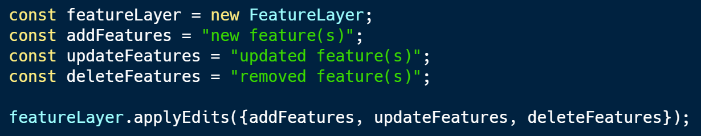
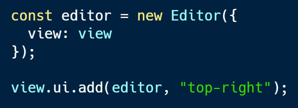

<!-- .slide: data-background="../../reveal.js/img/2019/uc/bg-1.png" -->

<h1 style="text-align: left; font-size: 80px;">Working with Feature Layers</h1>
<h2 style="text-align: left; font-size: 60px;">in the ArcGIS API for JavaScript</h2>
</br>
<p style="text-align: left; font-size: 30px;">Yann Cabon | Noah Sager</p>
    <p style="text-align: left; font-size: 30px;">slides: <a href="https://git.io/fjKQq"><code>https://git.io/fhp4D</code></a></p>

---

<!-- .slide: data-background="../../reveal.js/img/2019/uc/bg-2.png" -->

## Agenda

</br>

* Types of feature layers
* Rendering
* Labeling
* Querying
* Editing features

---

<!-- .slide: data-background="../../reveal.js/img/2019/uc/bg-3.png" -->

## Feature Layer powered by

* [Feature Services](https://developers.arcgis.com/javascript/latest/sample-code/layers-featurelayer/index.html)
* [Feature Collections](https://developers.arcgis.com/javascript/latest/sample-code/layers-featurelayer-collection/index.html)
* [Portal Item](https://developers.arcgis.com/javascript/latest/sample-code/layers-portal/index.html)

---

<!-- .slide: data-background="../../reveal.js/img/2019/uc/bg-3.png" -->

## Bringing a feature layer into your app

* FeatureLayer by URL

```ts
const layer = new FeatureLayer({
  url: "https://<url to my server>/FeatureServer",
  layerId: 0,
  renderer: { ... },
  popupTemplate: { ... },
});

map.add(layer);
```

[Demo](./demos/1_bringing_data/1_byUrl.html)

---

<!-- .slide: data-background="../../reveal.js/img/2019/uc/bg-3.png" -->

## Bringing a feature layer into your app

Restrict data retrieved from the feature service

* to work with a subset of features
* to remove features with `null` attributes.

```ts
layer.definitionExpression = "STATE_NAME = 'California'";
```

[Demo](./demos/1_bringing_data/2_byUrl_definitionExpression.html)

---

<!-- .slide: data-background="../../reveal.js/img/2019/uc/bg-3.png" -->

## Bringing a feature layer into your app

FeatureLayer by portal item

```ts
const portal = new Portal({
  url: "https://jsapi.maps.argis.com"
});

const layer = new FeatureLayer({
  portalItem: {
    id: "bca022ee5d9440c9b60399ee4d809d9b",
    portal
  }
});

map.add(layer);
```

[Demo](./demos/1_bringing_data/3_byPortalItem.html)

---

<!-- .slide: data-background="../../reveal.js/img/2019/uc/bg-3.png" -->

## Bringing a feature layer into your app

Alternative: using `Layer.fromPortalItem()`

```ts
Layer.fromPortalItem({
  portalItem: {
    id: "82d8d8213afc4bb380bb16083735f573"
  }
})
.then((layer) => {
  map.add(layer);
});
```

[Demo](./demos/1_bringing_data/4_byPortalItem_using_fromPortalItem.html)

---

<!-- .slide: data-background="../../reveal.js/img/2019/uc/bg-3.png" -->

## Rendering

A renderer defines how the `FeatureLayer` is drawn.

* SimpleRenderer
* ClassBreaksRenderer
* UniqueValueRenderer
* HeatmapRenderer
* DotDensityRenderer

Guides are available in the API:

* [Visualization Overview guide](https://developers.arcgis.com/javascript/latest/guide/visualization-overview/)
* [Renderer API reference](https://developers.arcgis.com/javascript/latest/api-reference/esri-renderers-Renderer.html)

---

<!-- .slide: data-background="../../reveal.js/img/2019/uc/bg-3.png" -->

## Building a renderer

* [simple renderer](./demos/2_visualization/1_simple-renderer.html)
* [visual variables](./demos/2_visualization/2_visual-variables.html)
* [smart mapping APIs](./demos/2_visualization/3_smart-mapping.html)
* [smart mapping sliders](./demos/2_visualization/4_slider.html)
* [loading from portal](./demos/2_visualization/5_portal-item.html)

---

<!-- .slide: data-background="../../reveal.js/img/2019/uc/bg-3.png" -->

## Rendering... next steps

<br>
<b>ArcGIS Online:</b>
<br>
<b>Using Map Styles to Discover and Define Your Web Map’s Purpose</b>
<br>
<br>
<i>Wednesday, July 10<br> 4:00 pm - 5:00 pm</i>
<br><i>Room 17 B</i>

---

<!-- .slide: data-background="../../reveal.js/img/2019/uc/bg-3.png" -->

## Labeling

</br>

Label features to show relevant information at a glance

</br>

* [simple labels](./demos/3_labeling/1_simple_label.html)
* [where clause](./demos/3_labeling/2_where_label.html)
* [multiple labels classes](./demos/3_labeling/3_multiple_label_classes.html)
* [min/max scale ranges](./demos/3_labeling/4_scaled_labels.html)
* [complex labels](./demos/3_labeling/5_final.html)

---

<!-- .slide: data-background="../../reveal.js/img/2019/uc/bg-3.png" -->

## Query the data from the server

Bring features from your data to the web browsers.

* <h4>Attribute queries</h4><small>select only features passing a WHERE SQL clause</small>
* <h4>Spatial queries</h4><small>select only features passing a spatial filter</small>
* <h4>Statistic queries</h4><small>returns statistics about the selected features</small>

[API Reference](https://developers.arcgis.com/javascript/latest/api-reference/esri-tasks-support-Query.html)

---

<!-- .slide: data-background="../../reveal.js/img/2019/uc/bg-3.png" -->

## Query the data from the server

* [queryFeatures()](./demos/5_query/1_query_features.html)
* [queryFeatures() - by distance](./demos/5_query/2_query_features_by_distance.html)
* [queryFeatures() - pagination](./demos/5_query/3_query_features_pagination.html)

---

<!-- .slide: data-background="../../reveal.js/img/2019/uc/bg-3.png" -->

## Query the data client-side

Query data already in the web browser

* really fast queries
* avoid round-trips to server
* only works with what is available

[Client-side statistics](./demos/6_client-side_statistics/index.html)

---

<!-- .slide: data-background="../../reveal.js/img/2019/uc/bg-3.png" -->

## Editing

</br>

Updating features directly in the web browser
</br>
</br>

---

<!-- .slide: data-background="../../reveal.js/img/2019/uc/bg-3.png" -->

## Editing

</br>

How do I know if I can edit features?
</br>
</br>
* [REST Supported Operations](https://services.arcgis.com/V6ZHFr6zdgNZuVG0/ArcGIS/rest/services/Thrift_Shops/FeatureServer/0)
* [ArcGIS Online / Portal Settings](https://jsapi.maps.arcgis.com/home/item.html?id=104c2a112e2242f69ac6bf5fb636cf04)
* ArcGIS Server Manager

---

<!-- .slide: data-background="../../reveal.js/img/2019/uc/bg-3.png" -->

## Editing

</br>

Two ways to edit features:

</br>

* [applyEdits()](https://developers.arcgis.com/javascript/latest/sample-code/editing-applyedits/live/index.html)

</br>
</br>

* [Editor widget](https://developers.arcgis.com/javascript/latest/sample-code/widgets-editor-basic/live/index.html)

---

<!-- .slide: data-background="../../reveal.js/img/2019/uc/bg-3.png" -->

## applyEdits()

</br>



</br>
</br>

[sample](https://developers.arcgis.com/javascript/latest/sample-code/editing-applyedits/live/index.html)

</br>
</br>

---

<!-- .slide: data-background="../../reveal.js/img/2019/uc/bg-3.png" -->

## Editor widget

</br>



</br>
</br>

[sample](https://developers.arcgis.com/javascript/latest/sample-code/popup-editaction/live/index.html)

</br>
</br>

---

<!-- .slide: data-background="../../reveal.js/img/2019/uc/bg-2.png" -->

## Related JavaScript Sessions at the UC
</br>
</br>


---

<!-- .slide: data-background="../../reveal.js/img/2019/uc/bg-2.png" -->

<b>ArcGIS API for JavaScript: What's New</b></br>
<i>Wednesday (1pm - 2pm)</i>
</br></br>
<b>Customizing ArcGIS API for JavaScript Widgets</b></br>
<i>Wednesday (2:30pm - 3:30pm)</i>
</br></br>
<b>Editing with the ArcGIS API for JavaScript</b></br>
<i>Wednesday (4pm - 5pm)</i>
</br></br>
<b>Building 3D GIS Applications with JavaScript</b></br>
<i>Thursday (8:30am - 9:30am)</i>
</br></br>
<b>Building Web Apps with the ArcGIS API for JavaScript</b></br>
<i>Thursday (4pm - 5pm)</i>

---

<!-- .slide: data-background="../../reveal.js/img/2019/uc/bg-2.png" -->

# Questions?

---

<!-- .slide: data-background="../../reveal.js/img/2019/uc/alias_slide.png" -->

---

<!-- .slide: data-background="../../reveal.js/img/2019/uc/bg-5.png" -->