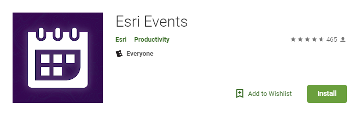

<!-- .slide: data-background="../../reveal.js/img/2019/uc/bg-1.png" -->

<h1 style="text-align: left; font-size: 80px;">Working with Feature Layers</h1>
<h2 style="text-align: left; font-size: 60px;">in the ArcGIS API for JavaScript</h2>
</br>
<p style="text-align: left; font-size: 30px;">Yann Cabon | Noah Sager</p>
    <p style="text-align: left; font-size: 30px;">slides: <a href="https://git.io/fjKQq"><code>https://git.io/fhp4D</code></a></p>

---

<!-- .slide: data-background="../../reveal.js/img/2019/uc/bg-2.png" -->

## Agenda

</br>

* Types of feature layers
* Visualization styles
* Labeling 
* Popups
* Querying
* Editing features

---

<!-- .slide: data-background="../../reveal.js/img/2019/uc/bg-3.png" -->

## Feature Layer powered by

* [Feature Services](https://developers.arcgis.com/javascript/latest/sample-code/layers-featurelayer/index.html)
* [Feature Collections](https://developers.arcgis.com/javascript/latest/sample-code/layers-featurelayer-collection/index.html)
* [Portal Item](https://developers.arcgis.com/javascript/latest/sample-code/layers-portal/index.html)

---

<!-- .slide: data-background="../../reveal.js/img/2019/uc/bg-3.png" -->

## Bringing a feature layer into your app

* FeatureLayer by URL

```ts
const layer = new FeatureLayer({
  url: "https://<url to my server>/FeatureServer",
  layerId: 0,
  renderer: { ... },
  popupTemplate: { ... },
});

map.add(layer);
```

[Demo](./demos/1_bringing_data/1_byUrl.html)

---

<!-- .slide: data-background="../../reveal.js/img/2019/uc/bg-3.png" -->

## Bringing a feature layer into your app

Restrict data retrieved from the feature service

* to work with a subset of features
* to remove features with `null` attributes.

```ts
layer.definitionExpression = "STATE_NAME = 'California'";
```

[Demo](./demos/1_bringing_data/2_byUrl_definitionExpression.html)

---

<!-- .slide: data-background="../../reveal.js/img/2019/uc/bg-3.png" -->

## Bringing a feature layer into your app

FeatureLayer by portal item

```ts
const portal = new Portal({
  url: "https://jsapi.maps.argis.com"
});

const layer = new FeatureLayer({
  portalItem: {
    id: "bca022ee5d9440c9b60399ee4d809d9b",
    portal
  }
});

map.add(layer);
```

[Demo](./demos/1_bringing_data/3_byPortalItem.html)

---

<!-- .slide: data-background="../../reveal.js/img/2019/uc/bg-3.png" -->

## Bringing a feature layer into your app

Alternative: using `Layer.fromPortalItem()`

```ts
Layer.fromPortalItem({
  portalItem: {
    id: "82d8d8213afc4bb380bb16083735f573"
  }
})
.then((layer) => {
  map.add(layer);
});
```

[Demo](./demos/1_bringing_data/4_byPortalItem_using_fromPortalItem.html)

---

<!-- .slide: data-background="../../reveal.js/img/2019/uc/bg-3.png" -->

## Visualization styles

---

<!-- .slide: data-background="../../reveal.js/img/2019/uc/bg-3.png" -->

## Labeling

</br>

Label features to show relevant information at a glance

</br>

* [simple labels](./demos/2_labeling/1_simple_label.html)
* [where clause](./demos/2_labeling/2_where_label.html)
* [multiple labels classes](./demos/2_labeling/3_multiple_label_classes.html)
* [min/max scale ranges](./demos/2_labeling/4_scaled_labels.html)
* [complex labels](./demos/2_labeling/5_final.html)

---

<!-- .slide: data-background="../../reveal.js/img/2019/uc/bg-3.png" -->

## Popups to communicate information

---

<!-- .slide: data-background="../../reveal.js/img/2019/uc/bg-3.png" -->

## Query the data from the server

* [queryFeatures()](./demos/3_query/1_query_features.html)
* [queryFeatures() - by distance](./demos/3_query/2_query_features_by_distance.html)
* [queryFeatures() - pagination](./demos/3_query/3_query_features_pagination.html)
* [queryAttachments()](./demos/3_query/4_query_attachments.html)
* [queryRelatedFeatures()](./demos/3_query/5_query_related_features.html)

---

<!-- .slide: data-background="../../reveal.js/img/2019/uc/bg-3.png" -->

## Query the data client-side

---

<!-- .slide: data-background="../../reveal.js/img/2019/uc/bg-3.png" -->

## Editing

</br>

* Applies edits to features in a layer
</br>
</br>
* New features can be created and existing features can be updated or deleted
</br>
</br>
* Only applies to layers in a feature service and client-side features set through the layer's source

</br>

</br>

[Samples](https://developers.arcgis.com/javascript/latest/sample-code/?search=editing)

---

<!-- .slide: data-background="../../reveal.js/img/2019/uc/bg-2.png" -->

## Related JavaScript Sessions at the UC
</br>
</br>


---

<!-- .slide: data-background="../../reveal.js/img/2019/uc/bg-2.png" -->

<b>ArcGIS API for JavaScript: What's New</b></br>
<i>Wednesday (1pm - 2pm)</i>
</br></br>
<b>Customizing ArcGIS API for JavaScript Widgets</b></br>
<i>Wednesday (2:30pm - 3:30pm)</i>
</br></br>
<b>Editing with the ArcGIS API for JavaScript</b></br>
<i>Wednesday (4pm - 5pm)</i>
</br></br>
<b>Building 3D GIS Applications with JavaScript</b></br>
<i>Thursday (8:30am - 9:30am)</i>
</br></br>
<b>Building Web Apps with the ArcGIS API for JavaScript</b></br>
<i>Thursday (4pm - 5pm)</i>

---

<!-- .slide: data-background="../../reveal.js/img/2019/uc/bg-2.png" -->

# Questions?

---

<!-- .slide: data-background="../../reveal.js/img/2019/uc/alias_slide.png" -->

---

<!-- .slide: data-background="../../reveal.js/img/2019/uc/bg-5.png" -->